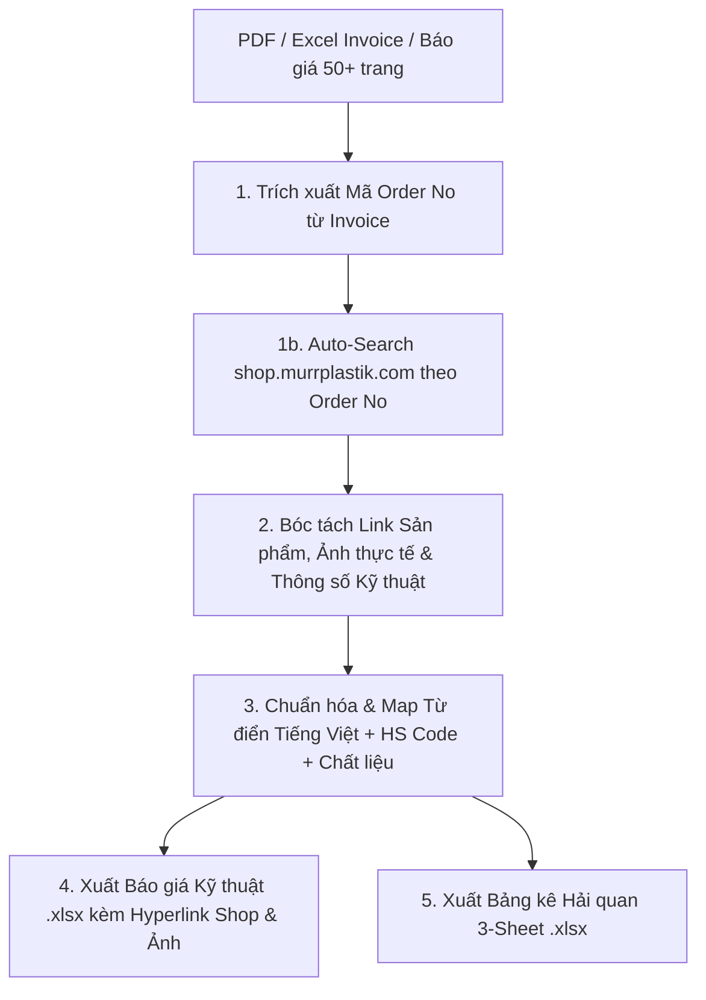

# QUY TRÌNH CHUẨN (SOP) - TỰ ĐỘNG HÓA BÁO GIÁ & KHAI BÁO HẢI QUAN HÀNG CÔNG NGHIỆP / MURRPLASTIK

Quy trình này hướng dẫn tự động hóa xử lý các hóa đơn, báo giá, bảng kê hải quan dài từ vài trang đến hàng chục/hàng trăm trang (PDF/Excel) từ hãng cấp Murrplastik (Đức) hoặc các nhà cung cấp công nghiệp.

---

## 🏗️ CẤU TRÚC PIPELINE TỰ ĐỘNG HÓA 5 BƯỚC



---

## 📌 BƯỚC 1: TRÍCH XUẤT MÃ ORDER NO & TRA CỨU TỰ ĐỘNG NGUỒN HÃNG (SHOP.MURRPLASTIK.COM)

### 1a. Trích xuất dữ liệu từ Invoice:
- Dùng Python (`pdfplumber` / `pandas`) quét mã vật tư / Order No (ví dụ: `83201208`, `83693082`, `83691502`).

### 1b. Tra cứu tự động trên Shop Murrplastik Đức theo Order No:
- **URL Tra cứu:** `https://shop.murrplastik.com/search?q={Order_No}` hoặc `matnr={Order_No}` (Ví dụ: `https://shop.murrplastik.com/search?q=83201208`).
- **Dữ liệu tự động bóc tách từ trang web hãng:**
  1. **Link Shop Sản phẩm:** URL chính thức của sản phẩm trên `shop.murrplastik.com`.
  2. **Hình ảnh sản phẩm gốc:** URL ảnh `.jpg` / `.webp` / `.png` chất lượng cao.
  3. **Mô tả kỹ thuật đầy đủ:** Tên thương mại, tiêu chuẩn kỹ thuật (IP65, IP68, dải nhiệt độ, chuẩn ren, đường kính).
  4. **Vật liệu cấu thành:** Nhựa Polyamide PA6, Thép mạ kẽm (Galvanized steel), Nhôm phay, Cao su Elastomer.

---

## 📌 BƯỚC 2: QUY TRÌNH CHUẨN HÓA VÀ ÁP MÃ HẢI QUAN (CUSTOMS DATA MAPPING)

Tự động kết hợp dữ liệu cào từ hãng với **Từ điển Danh mục Kỹ thuật Việt hóa** (Technical Dictionary):

### Bảng tra cứu Chuẩn hóa Hàng Murrplastik & Công nghiệp:

| Nhóm hàng | Tên Việt hóa Hải quan | Chất liệu cấu thành | Mã HS Code tham khảo | Công dụng |
| --- | --- | --- | --- | --- |
| **System Holder (SH)** | Giá đỡ ống luồn dây cáp bằng nhựa PA6 có nắp kim loại | Nhựa Polyamide PA6 + Nắp Thép | `3926.90.99` hoặc `7326.90.99` | Định vị gá đỡ ống dẫn hướng cáp trên robot |
| **R-Tec Liner** | Hộp cơ cấu thu hồi cáp tự động tích hợp lò xo | Nhựa PA6 + Lò xo Thép + Hợp kim Nhôm | `8479.89.99` hoặc `3926.90.99` | Tự động kéo rút đàn hồi bảo vệ cáp nguồn robot |
| **Strain Relief / A-ZS / R-ZL** | Vòng đệm / Tấm đệm cao su giảm ứng lực căng cáp | Cao su đàn hồi Elastomer | `4016.99.99` | Siết chặt giảm ứng lực căng kéo thắt cáp |
| **Ball Joint (KEG/KMG)** | Khớp nối cầu vạn năng định hướng ống luồn | Nhựa Polyamide PA6 | `3917.40.00` hoặc `3926.90.99` | Khớp nối xoay đa hướng cho ống luồn cáp |
| **Conduit Ring (SRF)** | Vòng định vị kẹp giữ ống luồn | Nhựa Polyamide PA6 | `3917.40.00` | Định vị hành trình co gập của ống |
| **Tubing (EW / EWX)** | Ống gợn sóng bảo vệ đường dây điện | Nhựa Polyamide PA6 | `3917.39.00` | Bọc bảo vệ cáp điện nguồn và tín hiệu |

---

## 📌 BƯỚC 3: XUẤT 2 FILE EXCEL CHUẨN KÈM HYPERLINK SẢN PHẨM & ẢNH HÃNG

### File 1: `Murrplastik_Danh_sach_vat_tu_Bao_gia_[Campaign].xlsx`
- **Mục đích:** Chào giá Kỹ thuật cho Khách hàng (VinFast, v.v.).
- **Định dạng:** 
  - Chia Sheet theo từng Dòng Máy / Robot (VD: Sheet `ABB IRB 7600`, Sheet `ABB IRB 6700`).
  - Gắn Hyperlink tự động dẫn đến **Shop Murrplastik chính hãng** (tra cứu theo Order No) và **Thư mục Ảnh thực tế Google Drive**.

### File 2: `Danh_sach_vat_tu_hai_quan_Murrplastik_[Campaign].xlsx`
- **Mục đích:** Khai báo & Giải trình Hải quan cho bộ phận XNK.
- **Cấu trúc 3 Sheet:**
  1. `Tong_hop_Hai_quan`: Danh mục gom tất cả mặt hàng + HS Code + Tên Việt Hóa + Chất liệu + Công dụng.
  2. `Chi_tiet_[Robot_1]`: Chi tiết phân bổ cho Robot 1.
  3. `Chi_tiet_[Robot_2]`: Chi tiết phân bổ cho Robot 2.
- **Định dạng giao diện:** Font Arial/Inter, Header màu Burgundy `#800020` chữ trắng, kẻ ô viền mảnh, căn lề văn bản tự động, tự động độ rộng cột (`autofit_columns`).

---

## 🛠️ CÁCH SỬ DỤNG SCRIPT TỰ ĐỘNG (PYTHON SCRIPT EXECUTION)

Chạy script Python trong thư mục `scripts/parse_and_export.py` để xử lý file Invoice 50+ trang và tự động cào Shop Murrplastik:

```bash
python .agents/skills/industrial-quote-customs-automation/scripts/parse_and_export.py --input "[Duong_dan_file_Invoice.pdf_hoac_xlsx]" --fetch-shop --output-dir "./"
```
