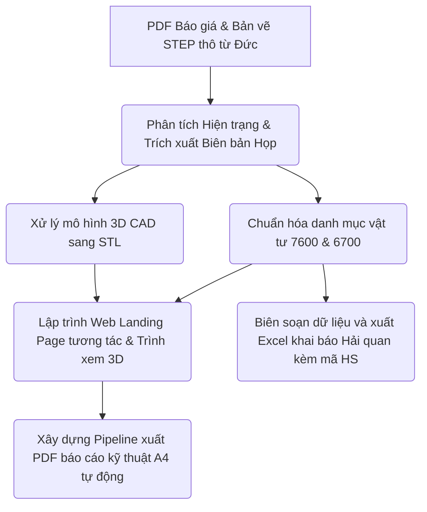

# QUY TRÌNH LÀM VIỆC CHI TIẾT (WORKFLOW) - DỰ ÁN DRESS PACK VINFAST

Tài liệu này tổng hợp toàn bộ các bước làm việc từ đầu đến cuối trong dự án khảo sát hiện trạng, đề xuất giải pháp kỹ thuật cải tiến hệ thống bảo vệ cáp (Dress Pack) của hãng **Murrplastik (Đức)** phối hợp với đại diện phân phối **T&T Vina** cho nhà máy sản xuất xe **VinFast Hải Phòng**.

Sơ đồ quy trình tổng quan:

---

## BƯỚC 1: TIẾP NHẬN & PHÂN TÍCH DỮ LIỆU ĐẦU VÀO (INPUT & ANALYSIS)

Quy trình bắt đầu khi tiếp nhận các dữ liệu báo giá thô và biên bản khảo sát hiện trạng:

1. **Dữ liệu báo giá thô từ Đức (Murrplastik Germany):**
   * Tiếp nhận các danh mục vật tư thô dưới dạng file PDF báo giá gốc:
     * `robot_ABB IRB 7600_325_3.1_Danh sách vật tư murrplastik báo_21147456.pdf`
     * `robot_ABB IRB 6700_325_3.1_Danh sách vật tư murrplastik báo_21147456_21147426.pdf`
   * Tiếp nhận danh sách đề xuất vật tư dự phòng (stock recommendations):
     * `Order sample ABB 6700 & 7600 for Vinfast.xls`
     * `Báo giá hạng mục cho ABB IRB 7600.xls` và `Báo giá hạng mục cho ABB IRB 6700.xls`

2. **Dữ liệu biên bản khảo sát hiện trạng (On-site Survey):**
   * Phân tích biên bản họp kỹ thuật trực tuyến ngày 23/06/2026 giữa VinFast, T&T Vina và chuyên gia hãng về sự cố đứt cáp nguồn hàn trên robot (`Bien_ban_cuoc_hop_online_Vinfast_2306_v2.pdf`).
   * Sử dụng script Python `extract_pdf.py` (thư viện `pypdf`) để trích xuất tự động văn bản từ biên bản sang dạng text dễ xử lý (`extracted_meeting_minutes.txt`).
   * **Kết quả phân tích nguyên nhân sự cố:**
     * Ống dẫn hướng cũ của Becker bị căng cơ học lớn và nứt vỡ tại các gá đỡ nhựa sau khoảng 100 chu kỳ chuyển động của robot.
     * Thiếu các vòng đệm cao su giảm căng (cable star) và vòng định vị hành trình (position markers), khiến dây cáp luồn bên trong bị trượt tự do, dẫn tới đứt cáp nguồn hàn gây dừng dây chuyền sản xuất.
     * Thống nhất phương án nâng cấp lên hệ thống hộp rút lò xo tự động **R-Tec Liner** (Murrplastik) để tự động bù trừ hành trình cho ống bảo vệ cáp.

---

## BƯỚC 2: XỬ LÝ DỮ LIỆU KỸ THUẬT & MÔ HÌNH 3D (CAD & DATA PROCESSING)

Chuyển đổi dữ liệu thô thành các định dạng tối ưu để trình diễn trực quan và chuẩn hóa danh mục:

1. **Chuyển đổi mô hình 3D CAD:**
   * Tiếp nhận bản vẽ cơ khí 3D gốc của hộp rút định dạng STEP (`R-Tec Liner 550mmEW_EWX 80 - 200N_83693086.stp`).
   * Viết và chạy script Python `convert_stp.py` sử dụng thư viện `cadquery` để chuyển đổi file STEP thành file lưới STL (`R-Tec_Liner_550mm.stl`) có dung lượng tối ưu, tương thích tốt với WebGL.

2. **Chuẩn hóa danh mục vật tư:**
   * Biên soạn và phân nhóm các linh kiện thực tế cần thay thế cho Robot ABB IRB 7600 và ABB IRB 6700 ra file Markdown (`Murrplastik_Danh sách vật tư_Robot_ABB_IRB_7600_6700_2706.md`) phục vụ mục đích lưu trữ và lập trình.

---

## BƯỚC 3: XÂY DỰNG TRANG WEB TRÌNH DIỄN TƯƠNG TÁC (WEB LANDING PAGE)

Xây dựng một nền tảng trình diễn trực tuyến để đại diện VinFast có thể xem giải pháp trực quan:

1. **Thiết kế Giao diện người dùng (Web GUI):**
   * Xây dựng file `index.html` với cấu trúc HTML5 chuẩn SEO, ngôn ngữ thiết kế Dark Theme cao cấp kết hợp hiệu ứng kính mờ (Glassmorphism).
   * Thiết kế file CSS (`style.css`) hỗ trợ thanh điều hướng thông minh (Scroll-Spy), bảng thông số vật tư tương tác và thư viện lightbox xem ảnh sự cố tại thực địa nhà máy VinFast.

2. **Tích hợp trình xem mô hình 3D tương tác:**
   * Lập trình mã Javascript (`app.js`) sử dụng thư viện **Three.js** để tạo một khung WebGL chứa mô hình 3D của `R-Tec_Liner_550mm.stl`.
   * Cấu hình ánh sáng, camera, bộ điều khiển xoay/phóng (OrbitControls) và hiệu ứng vòng xoay tải trang (loading-spinner) để kỹ sư có thể tương tác trực tiếp với mô hình trên trình duyệt.

---

## BƯỚC 4: XÂY DỰNG HỆ THỐNG XUẤT BÁO CÁO KỸ THUẬT PDF (PDF COMPILATION PIPELINE)

Để tạo ra tài liệu báo cáo giấy hoặc PDF hoàn chỉnh gửi lên ban lãnh đạo VinFast duyệt chi:

1. **Thiết kế Layout tối ưu bản in:**
   * Xây dựng file HTML báo cáo kỹ thuật `pdf_report.html` và file CSS `pdf_report.css` được thiết kế riêng theo chuẩn giấy A4 và margin in ấn.

2. **Lập trình xuất PDF tự động (Playwright Pipeline):**
   * Phát triển script Python `generate_pdf_report.py` (và `generate_pdf.py` kế thừa) sử dụng thư viện **Playwright** (trình duyệt Chromium không đầu).
   * Script hoạt động theo quy trình:
     1. Khởi chạy máy chủ HTTP nội bộ tạm thời để phục vụ file HTML.
     2. Sử dụng Playwright truy cập trang và đợi đến khi WebGL hiển thị ổn định (mô hình 3D render xong và ẩn vòng quay loading).
     3. Biên dịch toàn bộ nội dung thành file PDF `Bao_cao_giai_phap_Vinfast_Murrplastik.pdf` chất lượng cao, bao gồm header/footer tùy biến chứa tên báo cáo và số trang tự động tăng.

---

## BƯỚC 5: XUẤT DỮ LIỆU PHỤC VỤ KHAI BÁO HẢI QUAN (CUSTOMS EXPORT)

Hỗ trợ trực tiếp cho bộ phận Xuất nhập khẩu khi Cơ quan Hải quan yêu cầu làm rõ bản chất hàng hóa của lô hàng linh kiện:

1. **Biên soạn dữ liệu chuyên dụng cho Hải quan:**
   * Xác định tên gọi tiếng Việt chuẩn ngành, chất liệu cấu thành cụ thể (Polyamide, Nhôm, Cao su) và công dụng chi tiết của từng bộ phận khi lắp đặt lên robot.
   * Tra cứu và đề xuất mã HS Code tham khảo phù hợp cho từng loại mặt hàng (nhựa, cao su và cơ cấu nhôm/sắt).

2. **Lập trình xuất file Excel và lưu trữ tài liệu:**
   * Phát triển script Python `create_customs_excel.py` (sử dụng `pandas` và `openpyxl`) để tự động tạo file Excel `Danh_sach_vat_tu_hai_quan_Murrplastik_Vinfast.xlsx` chia làm 3 sheet riêng biệt, tích hợp sẵn các hyperlink dẫn đến thư mục ảnh thực tế trên Google Drive và website tra cứu sản phẩm của hãng.
   * Bổ sung các mã hàng phát sinh mới trong quá trình trao đổi kỹ thuật (như bộ vòng đánh dấu vị trí `83692698`).
   * Tài liệu hóa toàn bộ bảng dữ liệu Hải quan này vào tài liệu Markdown `customs_product_list.md` trong thư mục artifacts để tiện tham khảo.
